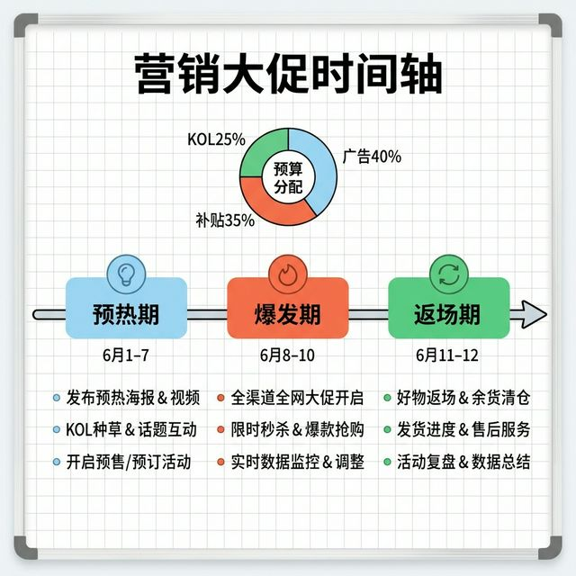
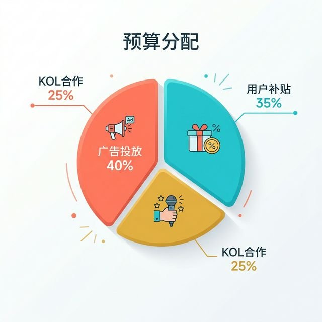

# 📝 Napkin — Visual Thinking Skill

> *"Any problem that can be described can be solved by drawing a picture."*
> — Dan Roam, *The Back of the Napkin*

An AI skill based on Dan Roam's visual thinking methodology (《一页纸工作整理术》). It turns complex problems into **actual infographic diagrams** — not just text advice about what to draw.

## ✨ What it does

Give it a complex problem, and it will:

1. **Analyze** using the SQVID framework and 6W's rule
2. **Generate real diagrams** — timelines, pie charts, flowcharts, quadrant maps
3. **Suggest a presentation flow** for meetings and pitches

## 🖼️ Examples

**Prompt**: *"明天我要展示营销大促方案，涉及预算分配、关键节点和拉新流程。"*

| Timeline | Budget | Funnel |
|:---:|:---:|:---:|
|  |  |  |

## 🚀 Installation

Copy this skill into your agent's skills directory:

```bash
# Clone
git clone https://github.com/douyixuan/claude-napking.git

# Copy to your project
cp -r claude-napking/.agent/skills/visual-thinking YOUR_PROJECT/.agent/skills/
```

Or simply copy `SKILL.md` into your `.agent/skills/visual-thinking/` directory.

## 📖 Frameworks Used

| Framework | Purpose |
|---|---|
| **SQVID** | 5 parameter pairs to decide visualization tone (Simple vs. Elaborate, Vision vs. Execution, etc.) |
| **6 W's** | Maps each question type to the right diagram (Who→Portrait, When→Timeline, How→Flowchart, etc.) |
| **4 Steps** | Look → See → Imagine → Show |

## 🗣️ Trigger Phrases

The skill activates when you say things like:
- "帮我用一页纸整理术理个思路"
- "用视觉化思考框架帮我分析"
- "SQVID"
- "Help me think through this visually"

## 📄 License

MIT
